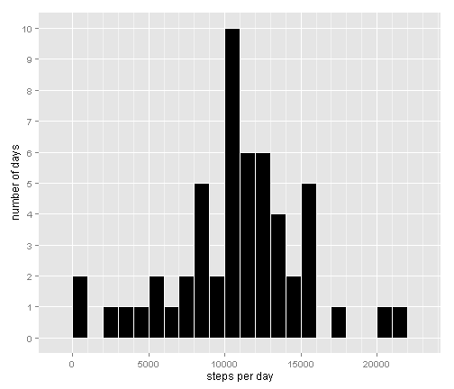
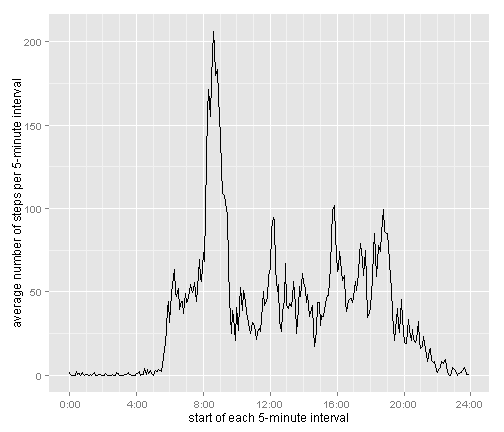
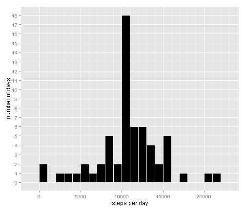
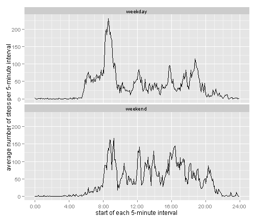

Reproducible Research - Peer Assessment 1
========================================================

## Loading and preprocessing the data
This project concerns two months of data from an anonymous individual recording the number of steps they made in each 5-minute interval during October and November 2012. The first task is to download and open the data file.


```r
library(plyr)
```

```
## Warning: package 'plyr' was built under R version 3.1.1
```

```r
library(ggplot2)
```

```
## Warning: package 'ggplot2' was built under R version 3.1.1
```

```r
library(knitr)
library(car)
```

```
## Warning: package 'car' was built under R version 3.1.1
```

```r
temp <- tempfile()
download.file("http://d396qusza40orc.cloudfront.net/repdata%2Fdata%2Factivity.zip",temp)
activity <- read.csv(unz(temp, "activity.csv"))
unlink(temp)
```

Each time interval is denoted by a number denoting its start time, such as '1935'. This *cannot* be interpreted as 'nineteen hundred and thirty five'. It needs to be converted to a number of minutes since midnight in order to be suitable for using along the x-axis of a chart later in the project. 

```r
activity$smoothtime <- floor(activity$interval/100)*60+activity$interval - 100*floor(activity$interval/100)
```
## What is mean total number of steps taken per day?
We now work out how many steps were taken each day:

```r
dailysteps <- ddply(activity,"date",summarise,steps = sum(steps))
```
and draw a histogram to show on how many days the number of steps taken fell within each 1000-step range:

```r
ggplot(dailysteps,aes(x=steps)) + geom_histogram(binwidth=1000,fill = "black", colour = "white") +
scale_y_continuous(breaks=seq(0, 10, 1)) +
scale_x_continuous(breaks=seq(0, 25000, 5000),minor_breaks = seq(0, 25000, 1000)) +
theme(panel.grid.minor.y = element_blank()) +
xlab("steps per day") + ylab("number of days")
```

 

Clearly, the commonest number of steps taken was between 10000 and 11000. The next chunk of code works out the mean and median total number of steps taken per day:

```r
meansteps <- sprintf("%.2f",mean(dailysteps$steps,na.rm=TRUE)) # avoiding scientific notation
mediansteps <- median(dailysteps$steps,na.rm=TRUE)
```
It calculates that the mean number of steps per day is 10766.19 and the median is 10765.

## What is the average daily activity pattern?
The number of steps in each 5-minute interval is now averaged over all the days, to produce an average pattern for a typical day:

```r
intervalsteps <- ddply(activity,c("interval","smoothtime"),summarise,steps = mean(steps,na.rm=TRUE))
```
We now want to illustrate this pattern as a time series plot. The x-axis (time) is measured in minutes since midnight, but we still want the labels to *appear* in the '19:35' format. The following function converts them back into that format, and is based on an example in http://www.cookbook-r.com/Graphs/Axes_(ggplot2)/ 

```r
intervallabels <- function(x) {
   hrs <- floor(x/60)
   mins <- x-60*hrs
   lab <- sprintf('%02s:%02d',hrs,mins)
}
```
We can now produce the time series plot as shown below:

```r
ggplot(intervalsteps,aes(x=smoothtime,y=steps)) + geom_line() + 
scale_x_continuous(label = intervallabels,breaks = seq(0,1440,240),minor_breaks= seq(0,1440,60)) +
xlab("start of each 5-minute interval") + ylab("average number of steps per 5-minute interval")
```

 

It is evident that the number of steps per interval reaches a peak in the morning. The following code identifes where this peak occurs:

```r
intervalsteps$maxsteps <- intervalsteps$steps==max(intervalsteps$steps,rm.na=TRUE)
maxinterval <- intervallabels(intervalsteps$smoothtime[intervalsteps$maxsteps])
```
The peak in fact occurs in the 5-minute interval commencing  8:35.

## Imputing missing values
A quick glance at the data will confirm that there are several days which are full of missing values. The next chunk of code works out how many rows of data are affected:

```r
missval <- sapply(activity, function(x) sum(is.na(x)))[1]
```
It tells us that there are 2304 missing values altogether.

One suggested way of dealing with the missing values was to replace each of them with the mean result for the relevant time interval, calculated from all the days when that interval *did* have a reading recorded. To do this, the data was first split into all those records without missing values, and all those with missing values:

```r
completerecs <- activity[complete.cases(activity),]
incompleterecs <- activity[!complete.cases(activity),]
```
For all the records in the incomplete data set, the missing number of steps was overwritten with the appropriate average by matching on the time interval. The complete and incomplete datasets were then appended together again:

```r
incompleterecs$steps<-intervalsteps[match(incompleterecs$interval,intervalsteps$interval),3]
imputed <- rbind(completerecs,incompleterecs)
```
Based on the new dataset with the imputed missing data, a new calculation was performed of how many steps were taken per day:

```r
dailysteps2 <- ddply(imputed,"date",summarise,steps = sum(steps))
```
A new histogram was then drawn:

```r
ggplot(dailysteps2,aes(x=steps)) + geom_histogram(binwidth=1000,fill = "black", colour = "white") +
scale_y_continuous(breaks=seq(0, 20, 1)) +
scale_x_continuous(breaks=seq(0, 25000, 5000),minor_breaks = seq(0, 25000, 1000)) +
theme(panel.grid.minor.y = element_blank()) +
xlab("steps per day") + ylab("number of days")
```

 

This time there is a more pronounced peak, because there were several days when the data was completely missing, which have each now been filled with exactly the same set of imputed data. The following chunk of code works out the new mean and median number of steps per day:

```r
meansteps2 <- sprintf("%.2f",mean(dailysteps2$steps,na.rm=TRUE))
mediansteps2 <- sprintf("%.2f",median(dailysteps2$steps,na.rm=TRUE))
```
The new mean is 10766.19, and the new median is 10766.19. 

It is striking, first of all, that the mean is unchanged from before. This has occurred because all the missing values were in fact complete *days* of missing values, so replacing them all with the corresponding mean from the complete records has not altered the daily average. 

It is also striking that now, the mean and the median are precisely the same. This is related to the fact that we now have several whole days of identical imputed records, all of them exactly conforming to the mean. It just so happens that when the days are placed in ascending order of number of steps, in order to calculate the median, one of these days sits right in the middle.

## Are there differences in activity patterns between weekdays and weekends?
To answer this final question, we first need to work out what day of the week each of the days was, and which ones fell at the weekend:

```r
imputed$dayofweek <- weekdays(as.Date(imputed$date))
imputed$daytype <- as.factor(recode(imputed$dayofweek, "c('Saturday', 'Sunday')='weekend'; else='weekday'"))
```
The number of steps in each 5-minute interval is now averaged separately for a typical weekday and a typical weekend day,  using the dataset with the filled-in missing values:

```r
imputedintervalsteps <- ddply(imputed,c("interval","smoothtime","daytype"),summarise,steps = mean
(steps,na.rm=TRUE))
```
This allows us to draw two time series plots, one for weekdays and one for weekends:

```r
ggplot(imputedintervalsteps,aes(x=smoothtime,y=steps)) + geom_line() + 
scale_x_continuous(label = intervallabels,breaks = seq(0,1440,240),minor_breaks= seq(0,1440,60)) +
xlab("start of each 5-minute interval") + ylab("average number of steps per 5-minute interval") +
facet_wrap(~daytype,nrow=2)
```

 

It can be seen that this individual tends to get up later at the weekend, and that his activity on Saturdays and Sundays is spread more evenly throughout the day than it is during the week.
